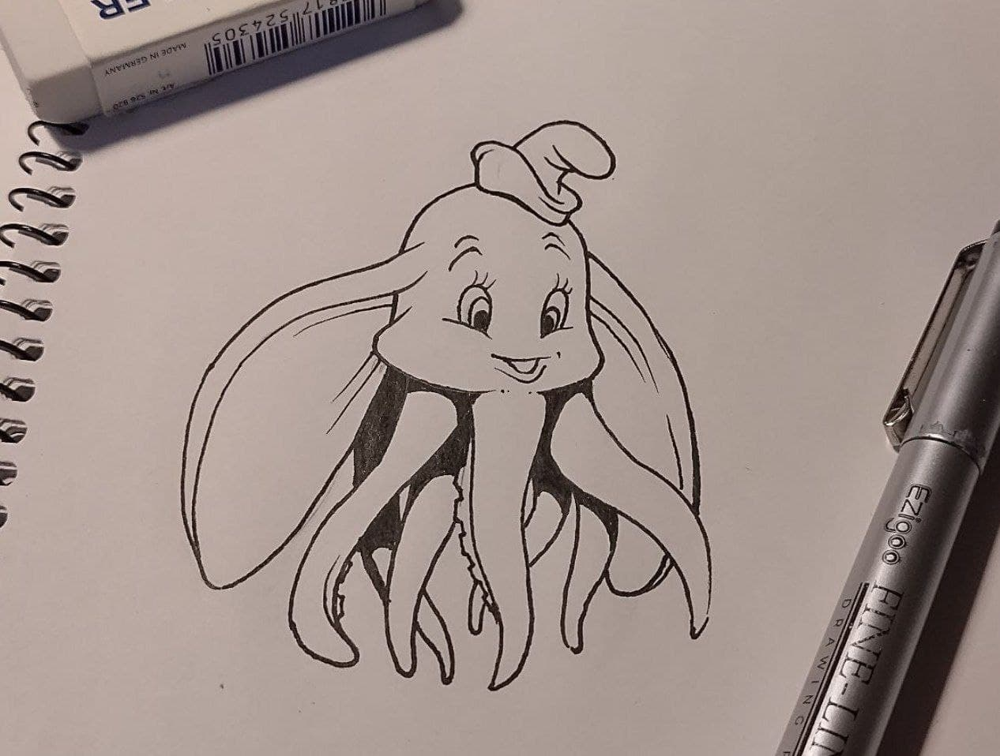
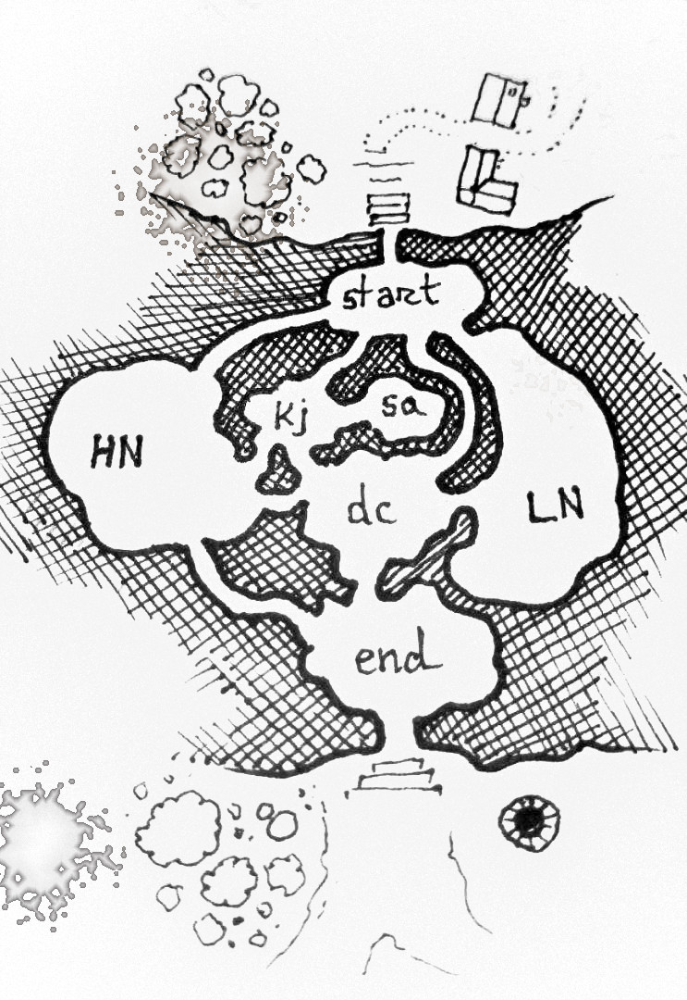
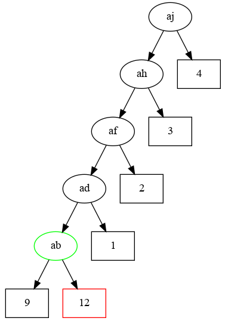

## ADVENT OF CODE 2021

My solutions for the [2021 Advent of code](https://adventofcode.com/2021).

- [Day 1: Sonar Sweep](./day01/day01.ipynb)
- [Day 2: Dive!](./day02/day02.ipynb)
- [Day 3: Binary Diagnostic](./day03/day03.ipynb)
- [Day 4: Giant Squid](./day04/day04.ipynb)
- [Day 5: Hydrothermal Venture](./day05/day05.ipynb)
- [Day 6: Lanternfish](./day06/day06.ipynb)
- [Day 7: The Treachery of Whales](./day07/day07.ipynb)
- [Day 8: Seven Segment Search](./day08/day08.ipynb)
- [Day 9: Smoke Basin](./day09/day09.ipynb)
- [Day 10: Syntax Scoring](./day10/day10.ipynb)
- [Day 11: Dumbo Octopus](./day11/day11.ipynb)

- [Day 12: Passage Pathing](./day12/day12.ipynb)

- [Day 13: Transparent Origami](./day13/day13.ipynb)
- [Day 14: Extended Polymerization](./day14/day14.ipynb)
- [Day 15: Chiton](./day15/day15.ipynb)

- [Day 16: Packet Decoder](./day16/day16.ipynb)
- [Day 17: Trick Shot](./day17/day17.ipynb)

- [Day 18: Snailfish](./day18/day18.ipynb)

